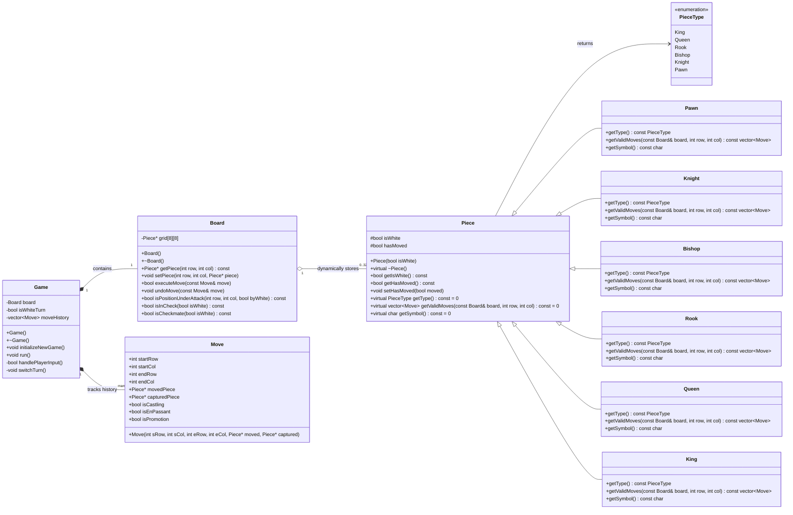

```mermaid
classDiagram
    direction LR

    %% Core Controller
    class Game {
        -Board board
        -bool isWhiteTurn
        -vector~Move~ moveHistory
        +Game()
        +~Game()
        +void initializeNewGame()
        +void run()
        -bool handlePlayerInput()
        -void switchTurn()
    }

    %% Board Management
    class Board {
        -Piece* grid[8][8]
        +Board()
        +~Board()
        +Piece* getPiece(int row, int col) const
        +void setPiece(int row, int col, Piece* piece)
        +bool executeMove(const Move& move)
        +void undoMove(const Move& move)
        +bool isPositionUnderAttack(int row, int col, bool byWhite) const
        +bool isInCheck(bool isWhite) const
        +bool isCheckmate(bool isWhite) const
    }

    %% Complex Move Descriptor (The "Receipt")
    class Move {
        +int startRow
        +int startCol
        +int endRow
        +int endCol
        +Piece* movedPiece
        +Piece* capturedPiece
        +bool isCastling
        +bool isEnPassant
        +bool isPromotion
        +Move(int sRow, int sCol, int eRow, int eCol, Piece* moved, Piece* captured)
    }

class PieceType {
<<enumeration>>
King
Queen
Rook
Bishop
Knight
Pawn
}

class Piece {
#bool isWhite
#bool hasMoved
+Piece(bool isWhite)
+virtual ~Piece()
+bool getIsWhite() const
+bool getHasMoved() const
+void setHasMoved(bool moved)
+virtual PieceType getType() const = 0
+virtual vector~Move~ getValidMoves(const Board& board, int row, int col) const = 0
+virtual char getSymbol() const = 0
}

class Pawn {
+getType() const PieceType
+getValidMoves(const Board& board, int row, int col) const vector~Move~
+getSymbol() const char
}

class Knight {
+getType() const PieceType
+getValidMoves(const Board& board, int row, int col) const vector~Move~
+getSymbol() const char
}

class Bishop {
+getType() const PieceType
+getValidMoves(const Board& board, int row, int col) const vector~Move~
+getSymbol() const char
}

class Rook {
+getType() const PieceType
+getValidMoves(const Board& board, int row, int col) const vector~Move~
+getSymbol() const char
}

class Queen {
+getType() const PieceType
+getValidMoves(const Board& board, int row, int col) const vector~Move~
+getSymbol() const char
}

class King {
+getType() const PieceType
+getValidMoves(const Board& board, int row, int col) const vector~Move~
+getSymbol() const char
}

Piece --> PieceType : returns
Piece <|-- Pawn
Piece <|-- Knight
Piece <|-- Bishop
Piece <|-- Rook
Piece <|-- Queen
Piece <|-- King

    %% Relationships and Cardinalities
    Game "1" *-- "1" Board : contains
    Game "1" *-- "many" Move : tracks history
    Board "1" o-- "0..32" Piece : dynamically stores
    
```