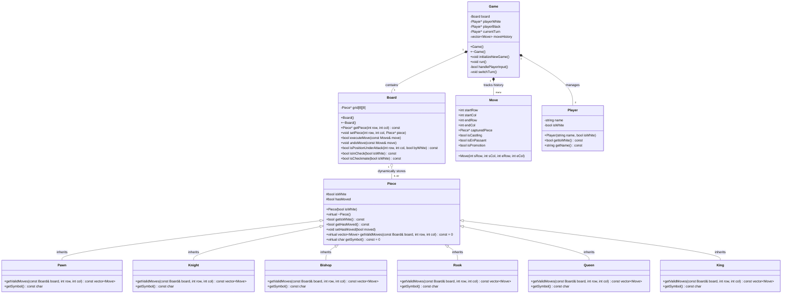

```mermaid
classDiagram
    %% Core Controller
    class Game {
        -Board board
        -Player* playerWhite
        -Player* playerBlack
        -Player* currentTurn
        -vector~Move~ moveHistory
        +Game()
        +~Game()
        +void initializeNewGame()
        +void run()
        -bool handlePlayerInput()
        -void switchTurn()
    }

    %% Board Management
    class Board {
        -Piece* grid[8][8]
        +Board()
        +~Board()
        +Piece* getPiece(int row, int col) const
        +void setPiece(int row, int col, Piece* piece)
        +bool executeMove(const Move& move)
        +void undoMove(const Move& move)
        +bool isPositionUnderAttack(int row, int col, bool byWhite) const
        +bool isInCheck(bool isWhite) const
        +bool isCheckmate(bool isWhite) const
    }

    %% Complex Move Descriptor
    class Move {
        +int startRow
        +int startCol
        +int endRow
        +int endCol
        +Piece* capturedPiece
        +bool isCastling
        +bool isEnPassant
        +bool isPromotion
        +Move(int sRow, int sCol, int eRow, int eCol)
    }

    %% Player Meta-data
    class Player {
        -string name
        -bool isWhite
        +Player(string name, bool isWhite)
        +bool getIsWhite() const
        +string getName() const
    }

    %% Abstract Base Class
    class Piece {
        #bool isWhite
        #bool hasMoved
        +Piece(bool isWhite)
        +virtual ~Piece()
        +bool getIsWhite() const
        +bool getHasMoved() const
        +void setHasMoved(bool moved)
        +virtual vector~Move~ getValidMoves(const Board& board, int row, int col) const = 0
        +virtual char getSymbol() const = 0
    }

    %% Derived Concrete Pieces
    class Pawn {
        +getValidMoves(const Board& board, int row, int col) const vector~Move~
        +getSymbol() const char
    }
    class Knight {
        +getValidMoves(const Board& board, int row, int col) const vector~Move~
        +getSymbol() const char
    }
    class Bishop {
        +getValidMoves(const Board& board, int row, int col) const vector~Move~
        +getSymbol() const char
    }
    class Rook {
        +getValidMoves(const Board& board, int row, int col) const vector~Move~
        +getSymbol() const char
    }
    class Queen {
        +getValidMoves(const Board& board, int row, int col) const vector~Move~
        +getSymbol() const char
    }
    class King {
        +getValidMoves(const Board& board, int row, int col) const vector~Move~
        +getSymbol() const char
    }

    %% Relationships and Cardnalities
    Game "1" *-- "1" Board : contains
    Game "1" *-- "2" Player : manages
    Game "1" *-- "many" Move : tracks history
    Board "1" o-- "0..32" Piece : dynamically stores
    Piece <|-- Pawn : inherits
    Piece <|-- Knight : inherits
    Piece <|-- Bishop : inherits
    Piece <|-- Rook : inherits
    Piece <|-- Queen : inherits
    Piece <|-- King : inherits
```
```